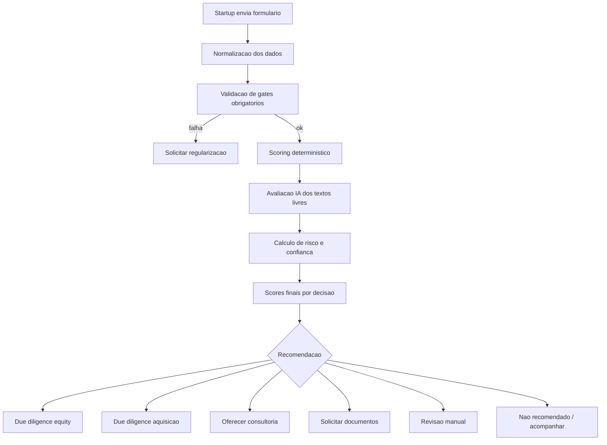

# Regra de Negócio — IA de Scoring de Startups e Projeto/Produto Principal

**Versão:** 1.0  
**Data:** 2026-05-05  
**Arquivo-base analisado:** `formulario_startups_bci.csv`  
**Objetivo:** especificar as regras de negócio para implementar, na plataforma existente, um algoritmo de scoring que apoie investidores na avaliação de startups para aquisição, participação em equity, investimento conversível, consultoria de crescimento, parceria estratégica ou acompanhamento até novos marcos de tração.

---

## 1. Contexto e premissas

A plataforma já possui um formulário no qual a startup cadastra dados do responsável, dados da empresa/startup e informações sobre seu principal projeto/produto. O CSV analisado contém **47 campos** e **2 registros de exemplo**. Portanto, o CSV deve ser usado como **referência de schema inicial**, e não como base estatística suficiente para calibrar pesos por aprendizado supervisionado.

O algoritmo deve ser implementado como um motor de decisão híbrido:

1. **Regras determinísticas** para enums, campos obrigatórios, documentos, riscos, estágios, ranges financeiros e status.
2. **IA/LLM supervisionada por rubricas** para interpretar campos textuais livres, como descrição, problema, diferencial, concorrentes, recursos disponíveis e experiência da equipe.
3. **Camada de auditoria** para registrar versão do algoritmo, campos usados, notas por dimensão, penalidades, evidências e justificativas.
4. **Separação entre cadastro e mérito de investimento**: dados pessoais do responsável devem ser usados para identificação, contato, elegibilidade e compliance, mas não para favorecer ou prejudicar a nota de mérito da startup.

---

## 2. Saídas esperadas do algoritmo

Cada submissão deve gerar, no mínimo, as seguintes saídas:

| Saída | Tipo | Escala | Descrição |
|---|---:|---:|---|
| `startup_score_base` | decimal | 0-100 | Nota da startup antes das penalidades de risco. |
| `product_score_base` | decimal | 0-100 | Nota do principal projeto/produto antes das penalidades de risco. |
| `risk_penalty` | decimal | 0-35 | Penalidade consolidada por riscos declarados, inconsistências e ausência de evidências críticas. |
| `startup_score_final` | decimal | 0-100 | Nota da startup após penalidade aplicável. |
| `product_score_final` | decimal | 0-100 | Nota do produto/projeto após penalidade aplicável. |
| `confidence_score` | decimal | 0-100 | Grau de confiança nas informações e evidências apresentadas. |
| `valuation_fit_score` | decimal | 0-100 | Coerência entre valuation, tração, faturamento, investimento desejado e evidências financeiras. |
| `equity_score` | decimal | 0-100 | Atratividade para participação em equity, SAFE, mútuo conversível ou instrumento similar. |
| `acquisition_score` | decimal | 0-100 | Atratividade para aquisição, acquihire, compra de tecnologia, IP ou carteira. |
| `consulting_score` | decimal | 0-100 | Atratividade para consultoria, aceleração, venture building ou growth advisory. |
| `risk_level` | enum | `baixo`, `medio`, `alto`, `critico` | Classificação geral de risco. |
| `recommended_action` | enum | ver seção 14 | Ação recomendada pelo motor de decisão. |
| `explanation` | JSON/texto | n/a | Justificativa auditável com fatores positivos, negativos, red flags e próximos passos. |

---

## 3. Campos detectados no CSV

### 3.1. Observações técnicas sobre o CSV

- Separador: ponto e vírgula `;`.
- Campos textuais estão entre aspas.
- Alguns campos armazenam arrays JSON como string, por exemplo: `canais`, `riscos`, `tipo_apoio`, `termos`.
- Campos de upload podem vir como `[]` ou como objeto JSON stringificado, por exemplo: `pitch_deck`, `cap_table`, `plano_financeiro`.
- Alguns campos usam o literal textual `NULL`; o backend deve normalizar para `null`.
- O campo `mvp_links` está vazio nos registros de exemplo; deve permanecer opcional, mas é uma evidência relevante de maturidade do produto.
- Há indício de possível inconsistência semântica entre `nome_startup` e `descricao` nos exemplos. A implementação deve validar os rótulos do formulário e, se necessário, corrigir o mapeamento antes de usar esses campos em produção.

### 3.2. Dicionário de dados e uso no scoring

| Campo CSV | Tipo esperado | Uso no algoritmo | Observação de regra |
|---|---|---|---|
| `id` | inteiro/string | Identificador | Não pontua. Usar para rastreabilidade. |
| `nome` | texto | Cadastro/KYC | Dado pessoal. Não usar no mérito do score. |
| `cpf` | texto | Cadastro/KYC | Dado pessoal. Validar formato e unicidade quando aplicável; não usar no mérito. |
| `nascimento` | data | Cadastro/KYC | Dado pessoal. Não usar no mérito. |
| `telefone` | texto | Contato | Validar presença/formato; não usar no mérito. |
| `email` | texto | Contato | Validar presença/formato; não usar no mérito. |
| `cidade` | texto | Segmentação | Pode apoiar análise regional, mas não deve penalizar automaticamente. |
| `nome_startup` | texto | Identificação da startup | Validar se contém nome da startup ou do responsável. |
| `descricao` | texto livre | IA: clareza da solução/produto | Campo textual relevante; validar rótulo real no formulário. |
| `setorStartup` | enum/texto | Mercado/setor | Usar para contextualizar tese, risco setorial e comparabilidade. |
| `problema` | enum | Produto: intensidade da dor | Pontuar problema conforme criticidade e clareza. |
| `problema_outro` | texto livre | IA: problema customizado | Usar quando `problema = outro` ou quando preenchido. |
| `tecnologia` | enum | Produto/tecnologia | Pontuar complexidade, escalabilidade e alinhamento tecnológico. |
| `tecnologia_outra` | texto livre | IA: tecnologia customizada | Usar quando `tecnologia = outra` ou quando preenchido. |
| `estagio` | enum | Tração/maturidade | Um dos campos mais importantes do score. |
| `publico` | enum | GTM/mercado | Contextualiza B2B, B2C, B2G etc. |
| `publico_outro` | texto livre | IA: público customizado | Normalizar `NULL` para `null`. |
| `canais` | array JSON | GTM/distribuição | Pontuar coerência e diversidade de canais, não apenas quantidade. |
| `tam` | enum/range | Mercado | Pontuar tamanho total de mercado. |
| `sam` | enum/range | Mercado | Pontuar mercado atendível. |
| `som` | enum/range | Mercado | Pontuar mercado capturável no curto/médio prazo. |
| `concorrentes` | texto livre | IA: concorrência | Avaliar conhecimento competitivo e realismo. |
| `diferencial` | enum | Defensibilidade | Pontuar tipo de diferencial declarado. |
| `diferencial_outro` | texto livre | IA: diferencial customizado | Usar quando preenchido. |
| `faturamento_atual` | enum/range | Tração financeira | Pontuar tração, ajustado pelo estágio. |
| `previsao_faturamento` | enum/range | Potencial financeiro | Avaliar com penalidade de otimismo se não houver evidência. |
| `valuation` | enum/range | Valuation fit | Avaliar coerência com tração e faturamento. |
| `investimento_desejado` | enum/range/valor | Necessidade de capital | Avaliar coerência com plano financeiro e recursos disponíveis. |
| `recursos_disponiveis` | texto livre | IA: execução | Avaliar clareza sobre uso de recursos, equipe, tecnologia e capital. |
| `captacao_anterior` | enum | Validação externa | Pontuar validação por editais, anjos, aceleradoras, fundos etc. |
| `riscos` | array JSON | Penalidades | Gerar penalidade e red flags. |
| `riscos_outro` | texto livre | IA: riscos adicionais | Normalizar `NULL` para `null`. |
| `estrutura_juridica` | enum | Prontidão legal | Relevante para equity e M&A. |
| `numero_integrantes` | inteiro | Time | Pontuar capacidade de execução, ajustada ao estágio. |
| `linkedin_equipe` | texto/link | Evidência do time | Usar como evidência, sem extrair atributos sensíveis. |
| `experiencia_equipe` | texto livre | IA: time | Avaliar experiência, complementaridade e execução. |
| `vinculo_parentesco` | enum | Conflito de interesse | Se houver vínculo, exigir revisão manual. |
| `tipo_apoio` | array JSON | Consultoria/gaps | Ajuda a definir plano de consultoria e tese de value creation. |
| `nivel_envolvimento` | enum | Consultoria/coachability | Pontuar disponibilidade de envolvimento. |
| `pitch_deck` | JSON upload/array | Evidência | Aumenta confiança; se parseado, pode enriquecer score. |
| `cap_table` | JSON upload/array | Evidência legal/equity | Crítico para equity e M&A. |
| `plano_financeiro` | JSON upload/array | Evidência financeira | Crítico para valuation fit e confiança. |
| `mvp_links` | texto/link | Evidência de produto | Relevante para produto, tecnologia e validação. |
| `termos` | array JSON | Gate obrigatório | Deve conter os consentimentos exigidos. |
| `data_criacao` | datetime | Auditoria | Usar para histórico e versionamento. |
| `data_atualizacao` | datetime | Auditoria | Recalcular score após atualização. |
| `status` | enum | Workflow | Não pontua mérito; controla fila e etapa. |

---

## 4. Normalização de dados

Antes de calcular qualquer score, a plataforma deve executar uma camada de normalização.

### 4.1. Regras gerais

1. Remover espaços extras no início/fim de strings.
2. Converter strings vazias, `"NULL"`, `"null"`, `"[]"` sem conteúdo e arrays vazios para `null` quando semanticamente aplicável.
3. Fazer parsing seguro de campos JSON stringificados.
4. Padronizar enums em lowercase, sem acentos e com `_` como separador.
5. Validar campos de upload como objeto estruturado com, no mínimo: `path`, `size`, `type` e `storedName` quando disponível.
6. Não usar dados pessoais sensíveis ou identificáveis como variáveis de mérito do score.
7. Armazenar os dados normalizados em estrutura separada da submissão bruta.

### 4.2. Campos JSON/array

Os campos abaixo devem ser convertidos para arrays:

```text
canais
riscos
tipo_apoio
termos
```

Se o valor vier como string JSON inválida, aplicar regra:

```text
campo_json_invalido = true
confidence_score -= penalidade_de_confianca
adicionar alerta: "Campo <nome> não pôde ser interpretado como JSON."
```

### 4.3. Campos de upload

Os campos abaixo podem vir como array vazio ou objeto JSON:

```text
pitch_deck
cap_table
plano_financeiro
```

Regra:

```pseudo
if valor == null or valor == []:
    upload_presente = false
else if contem path and size and type:
    upload_presente = true
else:
    upload_presente = false
    adicionar alerta de formato inválido
```

### 4.4. Ranges financeiros

Campos financeiros armazenados como enums devem ser convertidos para faixas numéricas aproximadas sempre que necessário para comparações internas:

```text
faturamento_atual
previsao_faturamento
valuation
investimento_desejado
tam
sam
som
```

A plataforma deve manter duas representações:

1. `valor_enum_original`: valor informado no formulário.
2. `range_normalizado`: objeto com `min`, `max`, `midpoint` e `currency` quando aplicável.

Exemplo:

```json
{
  "valor_enum_original": "10k_50k",
  "range_normalizado": {
    "min": 10000,
    "max": 50000,
    "midpoint": 30000,
    "currency": "BRL"
  }
}
```

---

## 5. Gates obrigatórios antes do scoring

Gates são condições que podem bloquear ou redirecionar a submissão antes da recomendação final.

| Gate | Regra | Resultado se falhar |
|---|---|---|
| Aceite de termos | `termos` deve conter `informacoes_verdadeiras`, `autorizo_contato` e `concordo_termos`. | `recommended_action = solicitar_regularizacao` |
| Contato mínimo | `email` e `telefone` devem estar presentes e válidos. | `recommended_action = solicitar_regularizacao` |
| Identificação mínima da startup | Deve haver nome da startup e descrição minimamente interpretável. | `recommended_action = solicitar_informacoes` |
| Conflito de interesse | Se `vinculo_parentesco = sim`, exigir revisão manual. | `recommended_action = revisao_manual` |
| Cap table para equity/M&A | Para decisão de equity ou aquisição, `cap_table` deve existir ou ser solicitado. | Não bloquear triagem; bloquear avanço para due diligence final. |
| Plano financeiro para investimento | Para decisão de equity, `plano_financeiro` deve existir ou ser solicitado. | Não bloquear triagem; reduzir confiança e bloquear comitê final. |
| Risco jurídico/regulatório crítico | Se `riscos` contiver risco jurídico/regulatório relevante e não houver mitigação. | `recommended_action = revisao_manual` |

---

## 6. Modelo de cálculo geral

### 6.1. Escala de notas por critério

Todo critério interno deve ser convertido para nota de 0 a 5.

| Nota | Significado |
|---:|---|
| 0 | Ausente, inválido ou impeditivo. |
| 1 | Muito fraco; hipótese sem evidência. |
| 2 | Sinal inicial, mas incompleto ou frágil. |
| 3 | Adequado ao estágio. |
| 4 | Forte, com boa evidência. |
| 5 | Excelente, diferenciado ou acima do esperado para o estágio. |

### 6.2. Fórmula por critério

```text
pontos_criterio = peso_criterio * (nota_0a5 / 5) * fator_confianca
```

Onde:

| `fator_confianca` | Uso |
|---:|---|
| 0.50 | Informação apenas autodeclarada. |
| 0.75 | Informação documentada, mas ainda não verificada. |
| 1.00 | Informação verificada por documento parseado, fonte independente, entrevista, auditoria ou integração de sistema. |

### 6.3. Fórmula de score final

```text
startup_score_base = soma_pontos_dimensoes_startup
product_score_base = soma_pontos_dimensoes_produto
risk_penalty = soma_penalidades_com_cap
startup_score_final = max(0, startup_score_base - min(risk_penalty, 30))
product_score_final = max(0, product_score_base - min(risk_penalty * 0.60, 20))
```

A penalidade incide mais sobre o score da startup do que sobre o score do produto, porque certos riscos legais, societários e financeiros podem ser da empresa, não necessariamente da qualidade técnica do produto.

---

## 7. Startup Score — dimensões e pesos

Total: **100 pontos**.

| Código | Dimensão | Peso | Campos principais |
|---|---|---:|---|
| S1 | Qualidade cadastral e elegibilidade | 5 | `termos`, `email`, `telefone`, `cidade`, `status` |
| S2 | Time, experiência e governança | 17 | `numero_integrantes`, `experiencia_equipe`, `linkedin_equipe`, `vinculo_parentesco` |
| S3 | Mercado e tese estratégica | 16 | `setorStartup`, `publico`, `tam`, `sam`, `som` |
| S4 | Tração e maturidade do negócio | 20 | `estagio`, `faturamento_atual`, `captacao_anterior`, `canais` |
| S5 | Modelo econômico e necessidade de capital | 20 | `previsao_faturamento`, `valuation`, `investimento_desejado`, `recursos_disponiveis`, `plano_financeiro` |
| S6 | Prontidão jurídica, societária e documental | 12 | `estrutura_juridica`, `cap_table`, `pitch_deck`, `termos` |
| S7 | Capacidade de execução e aderência a apoio | 10 | `tipo_apoio`, `nivel_envolvimento`, `recursos_disponiveis` |

### 7.1. S1 — Qualidade cadastral e elegibilidade, peso 5

| Subcritério | Peso | Regra |
|---|---:|---|
| Termos aceitos | 2 | Nota 5 se todos os termos obrigatórios foram aceitos; 0 se incompleto. |
| Contato válido | 2 | Nota 5 se email e telefone válidos; 2 se um dos dois estiver inválido; 0 se ambos ausentes. |
| Status processável | 1 | Nota 5 se `status` permite triagem, como `pendente`, `em_analise` ou equivalente. |

### 7.2. S2 — Time, experiência e governança, peso 17

| Subcritério | Peso | Regra |
|---|---:|---|
| Tamanho do time | 4 | Ver mapa de `numero_integrantes`. |
| Experiência da equipe | 7 | IA avalia `experiencia_equipe` por especificidade, senioridade, domínio e execução. |
| Evidência externa do time | 2 | Presença de `linkedin_equipe` ou documento equivalente aumenta confiança. |
| Governança/conflito | 4 | Penalizar se houver vínculo de parentesco não tratado ou ausência de sinais de governança. |

Mapa sugerido para `numero_integrantes`:

| Valor | Nota 0-5 |
|---:|---:|
| 0 ou ausente | 0 |
| 1 | 2 |
| 2 | 3 |
| 3 a 5 | 4 |
| 6 a 10 | 5 |
| acima de 10 | 4 |

Regra adicional: se o estágio for `ideacao`, times de 1 ou 2 pessoas não devem ser penalizados de forma agressiva; aplicar fator de ajuste positivo de até +0,5 na nota do subcritério.

### 7.3. S3 — Mercado e tese estratégica, peso 16

| Subcritério | Peso | Regra |
|---|---:|---|
| Setor e aderência à tese | 2 | Setor informado e compatível com tese do investidor recebe nota maior. |
| Público-alvo | 2 | Público claro recebe nota maior; `outro` sem descrição reduz nota. |
| TAM | 5 | Usar mapa de `tam`. |
| SAM | 4 | Usar mapa de `sam`. |
| SOM | 3 | Usar mapa de `som`; deve ser coerente com TAM/SAM. |

Mapa sugerido para `tam`:

| Enum | Nota 0-5 |
|---|---:|
| `ate_10mi` | 1 |
| `10_50mi` | 2 |
| `50_200mi` | 4 |
| `acima_200mi` | 5 |
| ausente/desconhecido | 0 |

Mapa sugerido para `sam`:

| Enum | Nota 0-5 |
|---|---:|
| `ate_500k` | 1 |
| `500k_1mi` | 2 |
| `1_5mi` | 3 |
| `5_20mi` | 4 |
| `acima_20mi` | 5 |
| ausente/desconhecido | 0 |

Mapa sugerido para `som`:

| Enum | Nota 0-5 |
|---|---:|
| `ate_100k` | 1 |
| `100k_500k` | 2 |
| `500k_1mi` | 3 |
| `1_5mi` | 4 |
| `acima_5mi` | 5 |
| ausente/desconhecido | 0 |

Regra de consistência:

```pseudo
if SOM > SAM or SAM > TAM:
    reduzir confidence_score
    adicionar alerta: "Inconsistência entre TAM, SAM e SOM."
```

### 7.4. S4 — Tração e maturidade do negócio, peso 20

| Subcritério | Peso | Regra |
|---|---:|---|
| Estágio | 9 | Usar mapa de `estagio`. |
| Faturamento atual | 5 | Pontuar tração financeira, ajustando por estágio. |
| Captação anterior | 3 | Pontuar validação externa, sem penalizar excessivamente quem nunca captou. |
| Canais | 3 | Avaliar coerência e viabilidade de canais. |

Mapa sugerido para `estagio`:

| Enum | Nota 0-5 | Interpretação |
|---|---:|---|
| `ideacao` | 1 | Ideia ainda sem validação robusta. |
| `prototipo` | 2 | Protótipo ou prova técnica inicial. |
| `mvp` | 2.5 | MVP criado, validação inicial. |
| `mvp_validado` | 3.5 | MVP validado com usuários/clientes. |
| `operacao` | 4 | Produto em operação e com uso recorrente. |
| `tracao` | 4.5 | Crescimento e receita recorrente. |
| `escala` | 5 | Escala comercial e operacional. |
| ausente/desconhecido | 0 | Não informado. |

Mapa sugerido para `faturamento_atual`:

| Enum | Nota 0-5 |
|---|---:|
| `sem_faturamento` | 1 |
| `ate_10k` | 2 |
| `10k_50k` | 3 |
| `50k_200k` | 4 |
| `acima_200k` | 5 |
| ausente/desconhecido | 0 |

Ajuste por estágio:

```pseudo
if estagio in ["ideacao", "prototipo", "mvp"] and faturamento_atual in ["sem_faturamento", "ate_10k"]:
    nao_aplicar_penalidade_extra

if estagio in ["operacao", "tracao", "escala"] and faturamento_atual in ["sem_faturamento", "ate_10k"]:
    adicionar alerta: "Baixa tração financeira para o estágio declarado."
    risk_penalty += 3
```

Mapa sugerido para `captacao_anterior`:

| Enum | Nota 0-5 |
|---|---:|
| `nao` | 2 |
| `editais` | 3.5 |
| `aceleradora` | 4 |
| `anjo` | 4 |
| `corporate` | 4 |
| `vc` | 5 |
| `outro` com descrição | 3 |
| ausente/desconhecido | 0 |

Regra para `canais`:

| Condição | Nota 0-5 |
|---|---:|
| Sem canais informados | 0 |
| 1 canal coerente com público-alvo | 2.5 |
| 2 a 3 canais coerentes | 4 |
| 4+ canais sem foco claro | 3 |
| Canais incompatíveis com público-alvo | 2 |

Exemplo de incompatibilidade: startup B2G que declara apenas mídias sociais como canal principal, sem licitações, parcerias institucionais, relacionamento público ou canal consultivo.

### 7.5. S5 — Modelo econômico e necessidade de capital, peso 20

| Subcritério | Peso | Regra |
|---|---:|---|
| Previsão de faturamento | 4 | Pontuar potencial, mas aplicar penalidade se muito superior à tração sem evidência. |
| Valuation | 5 | Avaliar coerência com receita, estágio, mercado e cap table. |
| Investimento desejado | 4 | Avaliar compatibilidade com estágio e plano de uso de recursos. |
| Recursos disponíveis | 3 | IA avalia clareza sobre recursos atuais e lacunas. |
| Plano financeiro | 4 | Presença e qualidade do documento aumentam nota e confiança. |

Regra de otimismo financeiro:

```pseudo
if previsao_faturamento muito_alta and faturamento_atual baixo and plano_financeiro ausente:
    risk_penalty += 4
    confidence_score -= 8
    adicionar alerta: "Previsão financeira agressiva sem evidência suficiente."
```

Regra de valuation:

```pseudo
if valuation == "nao_definido":
    valuation_fit_score recebe nota neutra-baixa
    adicionar alerta: "Valuation não definido."

if valuation alto and estagio inicial and faturamento baixo and plano_financeiro ausente:
    valuation_fit_score -= penalidade
    risk_penalty += 3
```

### 7.6. S6 — Prontidão jurídica, societária e documental, peso 12

| Subcritério | Peso | Regra |
|---|---:|---|
| Estrutura jurídica | 4 | Pontuar maturidade societária. |
| Cap table | 4 | Presença é essencial para equity/M&A. |
| Pitch deck | 2 | Aumenta prontidão e confiança. |
| Termos/compliance mínimo | 2 | Todos os termos obrigatórios aceitos. |

Mapa sugerido para `estrutura_juridica`:

| Enum | Nota 0-5 |
|---|---:|
| `ainda_nao` | 1 |
| `mei` | 2 |
| `sim_simplificada` | 3.5 |
| `ltda` | 4 |
| `sa` | 5 |
| `outro` com descrição | 3 |
| ausente/desconhecido | 0 |

Regra para `cap_table`:

| Condição | Nota 0-5 |
|---|---:|
| Ausente | 0 |
| Presente, mas não parseado | 3 |
| Presente e parseado com sócios/percentuais | 4 |
| Presente, parseado, sem inconsistências e com vesting/stock options claros | 5 |

### 7.7. S7 — Capacidade de execução e aderência a apoio, peso 10

| Subcritério | Peso | Regra |
|---|---:|---|
| Tipo de apoio solicitado | 4 | Pontuar clareza dos gargalos e aderência ao que a plataforma/investidor oferece. |
| Nível de envolvimento | 3 | Maior envolvimento tende a aumentar chance de consultoria bem-sucedida. |
| Recursos disponíveis | 3 | IA avalia se há recursos mínimos para executar as recomendações. |

Mapa sugerido para `nivel_envolvimento`:

| Enum | Nota 0-5 |
|---|---:|
| `pontual` | 2 |
| `squad_parcial` | 3.5 |
| `time_dedicado` | 5 |
| ausente/desconhecido | 0 |

---

## 8. Product Score — dimensões e pesos

Total: **100 pontos**.

| Código | Dimensão | Peso | Campos principais |
|---|---|---:|---|
| P1 | Clareza e intensidade do problema | 15 | `problema`, `problema_outro`, `descricao` |
| P2 | Solução, tecnologia e maturidade | 20 | `tecnologia`, `tecnologia_outra`, `estagio`, `mvp_links` |
| P3 | Público, canais e go-to-market | 15 | `publico`, `publico_outro`, `canais` |
| P4 | Mercado endereçável do produto | 15 | `tam`, `sam`, `som`, `setorStartup` |
| P5 | Diferenciação e defensibilidade | 15 | `diferencial`, `diferencial_outro`, `concorrentes` |
| P6 | Evidência de demanda e validação | 15 | `faturamento_atual`, `captacao_anterior`, `pitch_deck`, `mvp_links` |
| P7 | Viabilidade técnica e recursos | 5 | `recursos_disponiveis`, `tipo_apoio`, `riscos` |

### 8.1. P1 — Clareza e intensidade do problema, peso 15

A IA deve avaliar se o problema é específico, recorrente, caro, urgente e associado a um comprador/usuário claro.

Rubrica para campos `problema`, `problema_outro` e `descricao`:

| Nota | Critério |
|---:|---|
| 0 | Problema ausente ou incompreensível. |
| 1 | Problema genérico, sem público ou contexto. |
| 2 | Problema existe, mas dor e frequência não estão claras. |
| 3 | Problema claro para um público definido. |
| 4 | Problema relevante, recorrente e com custo de não resolver. |
| 5 | Problema crítico, urgente, frequente e com forte disposição de pagamento. |

### 8.2. P2 — Solução, tecnologia e maturidade, peso 20

Combina tecnologia declarada, estágio e evidências de MVP.

Regra base:

```pseudo
nota_tecnologia = score_enum_tecnologia(tecnologia)
nota_estagio_produto = score_enum_estagio(estagio)
nota_mvp = 5 se mvp_links presente e válido, 3 se pitch_deck descreve MVP, 0 se ausente
P2 = media_ponderada(nota_tecnologia, nota_estagio_produto, nota_mvp)
```

Mapa inicial para `tecnologia`:

| Enum | Nota 0-5 | Observação |
|---|---:|---|
| `saas` | 4 | Escalável se houver mercado e retenção. |
| `ia` ou `ai` | 4 | Exigir evidência de dados, modelo e custo de inferência. |
| `iot` | 3.5 | Exigir análise de hardware, supply chain e manutenção. |
| `marketplace` | 3.5 | Exigir liquidez dos dois lados. |
| `deeptech` | 3.5 | Alto potencial, mas maior risco técnico e ciclo longo. |
| `app` | 3 | Exigir retenção e aquisição eficiente. |
| `servico` | 2.5 | Menor escalabilidade se não houver produto replicável. |
| `outra` com descrição | 3 | IA avalia texto complementar. |
| ausente/desconhecido | 0 | Não informado. |

A nota da tecnologia não deve ser alta apenas por ser “sofisticada”. Deve refletir **aderência ao problema**, **escalabilidade** e **evidência de implementação**.

### 8.3. P3 — Público, canais e go-to-market, peso 15

Mapa inicial para `publico`:

| Enum | Nota 0-5 | Observação |
|---|---:|---|
| `b2b` | 4 | Bom potencial se houver venda consultiva e ROI claro. |
| `b2c` | 3 | Exigir retenção, CAC e escala. |
| `b2b2c` | 4 | Exigir clareza sobre quem paga e quem usa. |
| `b2g` | 3 | Exigir capacidade de venda pública, contratos e ciclo longo. |
| `outro` com descrição | 3 | IA avalia. |
| ausente/desconhecido | 0 | Não informado. |

Regra de canais:

```pseudo
if canais coerentes com publico:
    nota_canais = alta
else:
    nota_canais = baixa
```

A IA deve justificar a coerência. Exemplo: B2B enterprise com canal apenas de mídias sociais pode ser considerado frágil se não houver outbound, parcerias, inside sales, eventos, canais corporativos ou rede comercial.

### 8.4. P4 — Mercado endereçável do produto, peso 15

Usa os mapas de TAM/SAM/SOM definidos na seção S3. Adicionar uma checagem de realismo:

```pseudo
if TAM alto and SAM/SOM muito baixos:
    nao_penalizar automaticamente
    adicionar comentario: "Mercado grande, mas captura inicial limitada."

if TAM, SAM e SOM todos altos sem evidência de canal, tração ou plano:
    confidence_score -= 5
    adicionar alerta: "Mercado declarado elevado sem evidência suficiente."
```

### 8.5. P5 — Diferenciação e defensibilidade, peso 15

Mapa inicial para `diferencial`:

| Enum | Nota 0-5 |
|---|---:|
| `tecnologia_proprietaria` | 5 |
| `dados_proprietarios` | 5 |
| `network_effects` | 5 |
| `parcerias_estrategicas` | 4 |
| `marca` | 3.5 |
| `experiencia_usuario` | 3.5 |
| `preco` | 2.5 |
| `atendimento` | 2.5 |
| `outro` com descrição | IA avalia |
| ausente/desconhecido | 0 |

Regra para `concorrentes`:

| Condição | Nota 0-5 |
|---|---:|
| Ausente ou “não temos concorrentes” | 1 |
| Lista genérica sem comparação | 2 |
| Concorrentes claros com diferenciação básica | 3 |
| Concorrentes claros, alternativas indiretas e tese de diferenciação | 4 |
| Mapa competitivo robusto com vantagem defensável e evidências | 5 |

### 8.6. P6 — Evidência de demanda e validação, peso 15

Combinar sinais de faturamento, captação anterior, estágio, pitch deck e MVP.

```pseudo
nota_validacao = media_ponderada(
  score_faturamento_atual,
  score_estagio,
  score_captacao_anterior,
  score_mvp_links,
  score_pitch_deck
)
```

Regra:

- MVP validado com faturamento ou cliente pagante deve receber nota superior a ideia sem usuário.
- Captação por edital ou aceleradora é sinal positivo, mas não substitui tração de cliente.
- Pitch deck presente aumenta confiança, mas não deve substituir evidência real de uso.

### 8.7. P7 — Viabilidade técnica e recursos, peso 5

A IA deve avaliar se os recursos disponíveis são compatíveis com o tipo de produto e os riscos técnicos declarados.

| Condição | Regra |
|---|---|
| Produto técnico complexo + time pequeno + risco técnico declarado | Aumentar penalidade e recomendar due diligence técnica. |
| SaaS simples + MVP link + poucos riscos técnicos | Pontuar melhor. |
| IoT/hardware + ausência de plano financeiro ou supply chain | Reduzir score e confiança. |
| IA/deeptech + ausência de dados/modelo/equipe técnica | Reduzir score e recomendar validação técnica. |

---

## 9. Confidence Score

O `confidence_score` mede a confiabilidade da nota, não a qualidade da startup. Uma startup pode ter score promissor com baixa confiança, indicando necessidade de solicitar evidências.

Total: **100 pontos**.

| Dimensão | Peso | Regra |
|---|---:|---|
| Completude dos campos obrigatórios | 25 | Proporção de campos essenciais preenchidos e válidos. |
| Evidências documentais | 25 | Presença de pitch deck, cap table e documentos complementares. |
| Evidência financeira | 20 | Plano financeiro, coerência entre faturamento, previsão, valuation e investimento. |
| Evidência de time/produto | 15 | LinkedIn/equipe, MVP links, descrição técnica, experiência. |
| Consistência interna | 15 | Coerência entre estágio, receita, mercado, riscos, canais e documentos. |

### 9.1. Cálculo sugerido

```pseudo
confidence_score =
    0.25 * completeness_score +
    0.25 * documentary_evidence_score +
    0.20 * financial_evidence_score +
    0.15 * team_product_evidence_score +
    0.15 * consistency_score
```

### 9.2. Interpretação

| Faixa | Interpretação |
|---:|---|
| 85-100 | Alta confiança; informação bem documentada. |
| 70-84 | Boa confiança; poucas lacunas. |
| 50-69 | Confiança média; exige diligência complementar. |
| 30-49 | Baixa confiança; score deve ser usado apenas para triagem. |
| 0-29 | Muito baixa confiança; solicitar informações antes de qualquer decisão. |

---

## 10. Penalidades e red flags

### 10.1. Penalidade por riscos declarados

Campo: `riscos`.

| Risco | Penalidade sugerida |
|---|---:|
| `mercado` | +4 |
| `tecnicos` ou `tecnico` | +5 |
| `financeiros` ou `financeiro` | +6 |
| `juridicos` ou `juridico` | +8 |
| `regulatorios` ou `regulatorio` | +8 |
| `dados` ou `lgpd` | +8 |
| `equipe` | +4 |
| `comercial` | +4 |
| `operacional` | +4 |
| `outro` sem descrição | +5 |
| `outro` com descrição crítica | IA define de +3 a +10 |

Cap da penalidade por riscos declarados: **25 pontos**.

### 10.2. Penalidades por ausência de evidência

| Condição | Penalidade |
|---|---:|
| `cap_table` ausente e decisão-alvo inclui equity/M&A | +6 |
| `plano_financeiro` ausente e decisão-alvo inclui investimento | +5 |
| `pitch_deck` ausente | +2 |
| `mvp_links` ausente em estágio `mvp_validado`, `operacao`, `tracao` ou `escala` | +4 |
| `valuation` alto sem plano financeiro | +3 |
| `faturamento_atual` baixo em estágio avançado | +3 |
| `estrutura_juridica = ainda_nao` para equity/M&A | +5 |
| `vinculo_parentesco = sim` | Não penalizar automaticamente; enviar para revisão manual. |

### 10.3. Red flags bloqueantes ou de revisão manual

| Red flag | Ação |
|---|---|
| Termos obrigatórios incompletos | Solicitar regularização. |
| Dados de contato inválidos | Solicitar regularização. |
| Suspeita de campo essencial preenchido com texto sem sentido | Solicitar informações ou revisão manual. |
| Cap table ausente em operação de equity/M&A | Bloquear avanço para comitê final. |
| Plano financeiro ausente em operação de investimento | Bloquear aprovação final até envio. |
| Risco jurídico/regulatório crítico sem mitigação | Revisão manual. |
| Inconsistência severa entre estágio, faturamento e valuation | Revisão manual. |
| Vínculo de parentesco com decisor/investidor/plataforma | Revisão manual por conflito de interesse. |

---

## 11. Valuation Fit Score

O `valuation_fit_score` mede se a expectativa de valuation e investimento desejado é razoável diante da maturidade, mercado, faturamento, documentos e risco.

### 11.1. Entradas

```text
valuation
investimento_desejado
faturamento_atual
previsao_faturamento
estagio
tam
sam
som
plano_financeiro
cap_table
risk_penalty
```

### 11.2. Regras

| Condição | Efeito |
|---|---|
| Valuation não definido | Nota neutra-baixa; recomendar apoio em valuation. |
| Valuation baixo/moderado + boa tração | Aumentar fit. |
| Valuation alto + estágio inicial + baixa receita | Reduzir fit. |
| Investimento desejado compatível com estágio e plano financeiro | Aumentar fit. |
| Investimento desejado sem plano de uso de recursos | Reduzir fit. |
| Cap table ausente | Reduzir fit para equity/M&A. |
| Plano financeiro presente e coerente | Aumentar fit e confidence. |

### 11.3. Pseudocódigo

```pseudo
valuation_fit_score = 50

if valuation == "nao_definido":
    valuation_fit_score -= 10

if plano_financeiro_presente:
    valuation_fit_score += 15
else:
    valuation_fit_score -= 10

if cap_table_presente:
    valuation_fit_score += 10
else:
    valuation_fit_score -= 10

if estagio in ["ideacao", "prototipo", "mvp"] and valuation_elevado:
    valuation_fit_score -= 15

if faturamento_atual_alto and valuation_moderado:
    valuation_fit_score += 15

if investimento_desejado_alto and recursos_disponiveis_pouco_claros:
    valuation_fit_score -= 10

valuation_fit_score = clamp(valuation_fit_score, 0, 100)
```

---

## 12. Scores por tipo de decisão

### 12.1. Equity Score

Uso: participação societária, mútuo conversível, SAFE, investimento-anjo, venture capital ou corporate venture.

```text
equity_score =
  0.40 * startup_score_final +
  0.30 * product_score_final +
  0.15 * valuation_fit_score +
  0.15 * confidence_score
```

Regras adicionais:

- Se `cap_table` ausente: marcar `equity_ready = false`.
- Se `estrutura_juridica = ainda_nao`: marcar `equity_ready = false`, mas pode seguir para consultoria ou preparação.
- Se `confidence_score < 50`: não recomendar investimento direto; recomendar solicitação de evidências ou due diligence.

### 12.2. Acquisition Score

Uso: aquisição integral, aquisição de produto, acquihire, aquisição de IP/tecnologia ou incorporação estratégica.

```text
acquisition_score =
  0.30 * startup_score_final +
  0.35 * product_score_final +
  0.20 * strategic_fit_score +
  0.15 * integration_readiness_score
```

Como `strategic_fit_score` depende da tese do comprador, ele deve ser recebido como parâmetro externo. Se não houver contexto do comprador, usar valor padrão 50 e sinalizar baixa confiança.

Entradas sugeridas para `strategic_fit_score`:

```json
{
  "investor_thesis_sectors": ["SaaS", "Fintech", "Healthtech"],
  "preferred_technologies": ["saas", "ia", "iot"],
  "target_publics": ["b2b", "b2b2c"],
  "strategic_objectives": ["aquisicao_tecnologia", "expansao_carteira", "entrada_mercado"]
}
```

`integration_readiness_score` deve considerar:

- cap table presente;
- estrutura jurídica madura;
- produto documentado;
- pitch deck/documentação disponíveis;
- ausência de risco jurídico/regulatório crítico;
- clareza sobre equipe e recursos.

### 12.3. Consulting Score

Uso: consultoria de crescimento, aceleração, venture building, preparação para captação, produto, tecnologia, jurídico, vendas ou go-to-market.

```text
consulting_score =
  0.25 * startup_score_final +
  0.25 * product_score_final +
  0.20 * coachability_score +
  0.20 * bottleneck_solvability_score +
  0.10 * confidence_score
```

`coachability_score` usa principalmente:

```text
nivel_envolvimento
tipo_apoio
experiencia_equipe
recursos_disponiveis
status
```

`bottleneck_solvability_score` mede se os gargalos declarados são solucionáveis por consultoria. Exemplo: uma startup com produto validado, mas sem estrutura comercial, pode ser boa candidata à consultoria mesmo que ainda não seja boa candidata a equity.

Mapa inicial para `tipo_apoio`:

| Apoio solicitado | Interpretação |
|---|---|
| `produto` | Boa aderência se produto ainda está em MVP ou validação. |
| `tecnologia` | Exige capacidade técnica do consultor/squad. |
| `captacao` | Boa aderência se há tração mínima e documentos incompletos. |
| `juridico` | Boa aderência se risco é regularizável. |
| `vendas` ou `comercial` | Boa aderência se há produto validado e baixa tração. |
| `marketing` | Boa aderência se ICP e proposta de valor estão claros. |
| `financeiro` | Boa aderência se valuation/plano financeiro estão fracos. |

---

## 13. Uso da IA em campos textuais

A IA deve ser usada apenas para avaliar conteúdo não estruturado. Ela não deve substituir regras determinísticas, gates obrigatórios ou validações de compliance.

### 13.1. Campos avaliados por IA

```text
descricao
problema_outro
tecnologia_outra
publico_outro
concorrentes
diferencial_outro
recursos_disponiveis
riscos_outro
experiencia_equipe
```

### 13.2. Contrato de resposta da IA

A IA deve retornar JSON estrito, sem texto fora do JSON.

```json
{
  "field": "experiencia_equipe",
  "rubric": "team_experience",
  "score_0_to_5": 3.5,
  "confidence_0_to_1": 0.75,
  "evidence_quotes": [
    "trecho curto ou resumo do texto usado como evidência"
  ],
  "positive_factors": [
    "experiência prévia no setor"
  ],
  "negative_factors": [
    "não informa resultados mensuráveis"
  ],
  "red_flags": [],
  "needs_manual_review": false
}
```

### 13.3. Regras de segurança para IA

1. Não inferir idade, classe social, gênero, raça, religião, orientação sexual ou qualquer atributo sensível.
2. Não usar CPF, telefone, email ou nome do responsável como variável de mérito.
3. Não inventar informações ausentes.
4. Se o texto for insuficiente, retornar nota baixa ou média com baixa confiança.
5. Citar o campo usado como evidência, não fontes externas, salvo quando houver módulo explícito de enriquecimento externo.
6. Produzir justificativas curtas, auditáveis e vinculadas aos campos do formulário.
7. Em caso de conteúdo suspeito, ofensivo, inconsistente ou sem sentido, sinalizar `needs_manual_review = true`.

### 13.4. Rubricas de IA

#### Problema e dor

| Nota | Regra |
|---:|---|
| 0 | Texto ausente. |
| 1 | Texto genérico ou sem problema claro. |
| 2 | Problema identificado, mas sem público, frequência ou impacto. |
| 3 | Problema claro e público definido. |
| 4 | Problema claro, frequente, com impacto econômico/operacional. |
| 5 | Problema crítico, urgente, mensurável e com disposição de pagamento evidente. |

#### Diferenciação

| Nota | Regra |
|---:|---|
| 0 | Ausente. |
| 1 | Diferencial genérico, como “qualidade” sem evidência. |
| 2 | Diferencial comum, fácil de copiar. |
| 3 | Diferencial claro, mas ainda pouco defensável. |
| 4 | Diferencial relevante com barreiras parciais. |
| 5 | Diferencial defensável por tecnologia, dados, rede, IP, contratos ou distribuição. |

#### Experiência da equipe

| Nota | Regra |
|---:|---|
| 0 | Ausente. |
| 1 | Experiência genérica, sem domínio claro. |
| 2 | Alguma experiência, mas pouca aderência ao problema. |
| 3 | Experiência adequada ao estágio. |
| 4 | Experiência relevante no setor, produto ou venda. |
| 5 | Time complementar com histórico comprovado de execução, venda, tecnologia e/ou mercado. |

#### Recursos disponíveis

| Nota | Regra |
|---:|---|
| 0 | Ausente ou incompreensível. |
| 1 | Recursos insuficientes e sem plano. |
| 2 | Recursos mínimos, mas lacunas importantes. |
| 3 | Recursos adequados para próximo marco. |
| 4 | Recursos claros e coerentes com execução. |
| 5 | Recursos robustos, equipe, tecnologia, capital e plano de uso claros. |

---

## 14. Recomendações automáticas

### 14.1. Faixas de score

| Score | Interpretação |
|---:|---|
| 85-100 | Forte candidato; avançar para due diligence aprofundada. |
| 70-84 | Bom candidato; avançar com validações pontuais. |
| 55-69 | Potencial moderado; recomendar consultoria, piloto, preparação ou solicitação de evidências. |
| 40-54 | Alto risco; acompanhar, solicitar melhorias ou considerar apenas consultoria específica. |
| 0-39 | Não recomendado no momento, salvo exceção estratégica manual. |

### 14.2. Enum `recommended_action`

| Ação | Quando usar |
|---|---|
| `avancar_due_diligence_equity` | `equity_score >= 75`, `confidence_score >= 65`, sem red flag crítica. |
| `avancar_due_diligence_aquisicao` | `acquisition_score >= 75`, fit estratégico alto e prontidão documental mínima. |
| `oferecer_consultoria_crescimento` | `consulting_score >= 65` e gargalo solucionável por apoio externo. |
| `solicitar_documentos` | Score promissor, mas falta pitch deck, cap table, plano financeiro ou MVP. |
| `solicitar_informacoes` | Campos textuais ou financeiros insuficientes. |
| `preparar_para_captacao` | Produto/startup promissor, mas valuation, cap table ou plano financeiro fracos. |
| `acompanhar_maturacao` | Startup inicial com potencial, mas baixa tração. |
| `revisao_manual` | Conflito, risco crítico, inconsistência severa ou alerta de IA. |
| `nao_recomendado` | Scores baixos e ausência de evidências suficientes. |
| `solicitar_regularizacao` | Falha em gate obrigatório de contato, termos ou cadastro. |

### 14.3. Árvore de decisão resumida

```pseudo
if gate_obrigatorio_falhou:
    recommended_action = "solicitar_regularizacao"
else if needs_manual_review:
    recommended_action = "revisao_manual"
else if equity_score >= 75 and confidence_score >= 65 and equity_ready:
    recommended_action = "avancar_due_diligence_equity"
else if acquisition_score >= 75 and confidence_score >= 65 and acquisition_ready:
    recommended_action = "avancar_due_diligence_aquisicao"
else if consulting_score >= 65:
    recommended_action = "oferecer_consultoria_crescimento"
else if confidence_score < 50 and max(equity_score, acquisition_score, consulting_score) >= 55:
    recommended_action = "solicitar_documentos"
else if startup_score_final >= 55 or product_score_final >= 55:
    recommended_action = "acompanhar_maturacao"
else:
    recommended_action = "nao_recomendado"
```

---

## 15. Classificação de risco

```pseudo
if risk_penalty >= 25 or red_flag_critica:
    risk_level = "critico"
elif risk_penalty >= 16:
    risk_level = "alto"
elif risk_penalty >= 8:
    risk_level = "medio"
else:
    risk_level = "baixo"
```

Regras adicionais:

- `risk_level = critico` não significa rejeição automática; significa que o caso deve ser revisto manualmente antes de qualquer recomendação transacional.
- Para consultoria, risco alto pode indicar oportunidade de trabalho, desde que seja regularizável e a startup demonstre envolvimento.
- Para equity/M&A, risco alto deve travar aprovação final até due diligence complementar.

---

## 16. Estrutura de dados recomendada

### 16.1. Tabela principal de resultado

Tabela sugerida: `startup_scoring_results`.

| Campo | Tipo | Descrição |
|---|---|---|
| `id` | uuid/int | Identificador do resultado. |
| `submission_id` | int/string | Referência ao formulário original. |
| `algorithm_version` | string | Versão da regra de scoring. |
| `startup_score_base` | decimal | Score base da startup. |
| `product_score_base` | decimal | Score base do produto/projeto. |
| `risk_penalty` | decimal | Penalidade total. |
| `startup_score_final` | decimal | Score final da startup. |
| `product_score_final` | decimal | Score final do produto/projeto. |
| `confidence_score` | decimal | Confiança. |
| `valuation_fit_score` | decimal | Fit de valuation. |
| `equity_score` | decimal | Score para equity. |
| `acquisition_score` | decimal | Score para aquisição. |
| `consulting_score` | decimal | Score para consultoria. |
| `risk_level` | enum | Baixo, médio, alto ou crítico. |
| `recommended_action` | enum | Ação recomendada. |
| `equity_ready` | boolean | Pronto para avançar em equity. |
| `acquisition_ready` | boolean | Pronto para M&A. |
| `consulting_ready` | boolean | Pronto para consultoria. |
| `needs_manual_review` | boolean | Exige revisão manual. |
| `explanation_json` | json | Justificativas e fatores. |
| `normalized_input_snapshot` | json | Snapshot dos dados normalizados usados no cálculo. |
| `created_at` | datetime | Data do cálculo. |
| `updated_at` | datetime | Última atualização. |

### 16.2. Tabela de dimensões

Tabela sugerida: `startup_scoring_dimensions`.

| Campo | Tipo | Descrição |
|---|---|---|
| `id` | uuid/int | Identificador. |
| `scoring_result_id` | uuid/int | Referência ao resultado. |
| `dimension_code` | string | Ex.: `S1`, `P5`, `CONF`, `RISK`. |
| `dimension_name` | string | Nome da dimensão. |
| `weight` | decimal | Peso da dimensão. |
| `raw_score_0_to_5` | decimal | Nota original. |
| `confidence_factor` | decimal | Fator 0.50, 0.75 ou 1.00. |
| `weighted_points` | decimal | Pontos ponderados. |
| `evidence` | json | Campos/evidências usados. |
| `explanation` | text/json | Justificativa. |

### 16.3. Log de alertas

Tabela sugerida: `startup_scoring_alerts`.

| Campo | Tipo | Descrição |
|---|---|---|
| `id` | uuid/int | Identificador. |
| `scoring_result_id` | uuid/int | Referência ao resultado. |
| `severity` | enum | `info`, `warning`, `high`, `critical`. |
| `code` | string | Código do alerta. |
| `message` | text | Mensagem auditável. |
| `field_name` | string | Campo relacionado. |
| `requires_manual_review` | boolean | Indica revisão manual. |

---

## 17. JSON final esperado pela API

A API de scoring deve retornar algo neste formato:

```json
{
  "submission_id": "123",
  "algorithm_version": "1.0",
  "scores": {
    "startup_score_base": 68.4,
    "product_score_base": 72.1,
    "risk_penalty": 9.0,
    "startup_score_final": 59.4,
    "product_score_final": 66.7,
    "confidence_score": 61.5,
    "valuation_fit_score": 54.0,
    "equity_score": 59.9,
    "acquisition_score": 62.3,
    "consulting_score": 70.8
  },
  "readiness": {
    "equity_ready": false,
    "acquisition_ready": false,
    "consulting_ready": true
  },
  "risk": {
    "risk_level": "medio",
    "risk_penalty": 9.0,
    "red_flags": [
      {
        "code": "MISSING_CAP_TABLE",
        "severity": "warning",
        "message": "Cap table ausente ou não interpretável."
      }
    ]
  },
  "recommendation": {
    "recommended_action": "oferecer_consultoria_crescimento",
    "summary": "Startup com potencial de produto, mas ainda sem evidências suficientes para equity. Recomenda-se consultoria de preparação e solicitação de documentos."
  },
  "dimension_scores": [
    {
      "code": "S4",
      "name": "Tração e maturidade do negócio",
      "weight": 20,
      "raw_score_0_to_5": 3.2,
      "confidence_factor": 0.75,
      "weighted_points": 9.6,
      "evidence_fields": ["estagio", "faturamento_atual", "captacao_anterior", "canais"]
    }
  ],
  "audit": {
    "calculated_at": "2026-05-05T00:00:00Z",
    "input_hash": "sha256:<hash-do-snapshot-normalizado>",
    "manual_review_required": false
  }
}
```

---

## 18. Pseudocódigo de implementação

```pseudo
function calculateStartupScoring(rawSubmission, investorContext = null):
    normalized = normalizeSubmission(rawSubmission)

    gates = evaluateMandatoryGates(normalized)
    if gates.hasBlockingFailure:
        return buildBlockedResult(normalized, gates)

    aiResults = evaluateTextFieldsWithAI(normalized)

    startupBase = calculateStartupBaseScore(normalized, aiResults)
    productBase = calculateProductBaseScore(normalized, aiResults)
    confidence = calculateConfidenceScore(normalized, aiResults)
    riskPenalty = calculateRiskPenalty(normalized, aiResults)
    valuationFit = calculateValuationFitScore(normalized, aiResults)

    startupFinal = clamp(startupBase - min(riskPenalty, 30), 0, 100)
    productFinal = clamp(productBase - min(riskPenalty * 0.60, 20), 0, 100)

    strategicFit = calculateStrategicFit(normalized, investorContext)
    integrationReadiness = calculateIntegrationReadiness(normalized, confidence, riskPenalty)
    coachability = calculateCoachability(normalized, aiResults)
    bottleneckSolvability = calculateBottleneckSolvability(normalized, aiResults)

    equityScore = clamp(
        0.40 * startupFinal +
        0.30 * productFinal +
        0.15 * valuationFit +
        0.15 * confidence,
        0,
        100
    )

    acquisitionScore = clamp(
        0.30 * startupFinal +
        0.35 * productFinal +
        0.20 * strategicFit +
        0.15 * integrationReadiness,
        0,
        100
    )

    consultingScore = clamp(
        0.25 * startupFinal +
        0.25 * productFinal +
        0.20 * coachability +
        0.20 * bottleneckSolvability +
        0.10 * confidence,
        0,
        100
    )

    riskLevel = classifyRisk(riskPenalty, gates, aiResults)
    readiness = calculateReadiness(normalized, confidence, riskLevel)
    recommendation = chooseRecommendedAction(
        gates,
        readiness,
        equityScore,
        acquisitionScore,
        consultingScore,
        confidence,
        riskLevel
    )

    return buildScoringResult(
        normalized,
        startupBase,
        productBase,
        startupFinal,
        productFinal,
        confidence,
        riskPenalty,
        riskLevel,
        valuationFit,
        equityScore,
        acquisitionScore,
        consultingScore,
        readiness,
        recommendation,
        aiResults
    )
```

---

## 19. Configuração inicial em JSON

A implementação deve manter pesos e mapas em configuração versionada, não hardcoded no código de aplicação.

```json
{
  "algorithm_version": "1.0",
  "score_scale": {
    "min": 0,
    "max": 100
  },
  "criterion_scale": {
    "min": 0,
    "max": 5
  },
  "confidence_factors": {
    "self_declared": 0.5,
    "documented": 0.75,
    "verified": 1.0
  },
  "startup_weights": {
    "S1_quality_eligibility": 5,
    "S2_team_governance": 17,
    "S3_market_strategy": 16,
    "S4_traction_maturity": 20,
    "S5_economics_capital": 20,
    "S6_legal_documentary_readiness": 12,
    "S7_execution_support_fit": 10
  },
  "product_weights": {
    "P1_problem_clarity": 15,
    "P2_solution_technology_maturity": 20,
    "P3_gtm_channels": 15,
    "P4_addressable_market": 15,
    "P5_differentiation_defensibility": 15,
    "P6_demand_validation": 15,
    "P7_technical_resource_feasibility": 5
  },
  "decision_weights": {
    "equity": {
      "startup_score_final": 0.40,
      "product_score_final": 0.30,
      "valuation_fit_score": 0.15,
      "confidence_score": 0.15
    },
    "acquisition": {
      "startup_score_final": 0.30,
      "product_score_final": 0.35,
      "strategic_fit_score": 0.20,
      "integration_readiness_score": 0.15
    },
    "consulting": {
      "startup_score_final": 0.25,
      "product_score_final": 0.25,
      "coachability_score": 0.20,
      "bottleneck_solvability_score": 0.20,
      "confidence_score": 0.10
    }
  },
  "risk_penalty_cap": 35,
  "startup_risk_penalty_cap": 30,
  "product_risk_penalty_cap": 20
}
```

---

## 20. Regras de versionamento e recalculo

1. Todo cálculo deve gravar `algorithm_version`.
2. Se a submissão for atualizada, recalcular o score e preservar histórico.
3. Se os pesos mudarem, criar nova versão do algoritmo, por exemplo `1.1`, e não sobrescrever resultados antigos sem registrar migração.
4. O resultado deve guardar um hash do snapshot normalizado usado no cálculo.
5. O usuário administrador deve conseguir comparar scores entre versões.

---

## 21. Workflow sugerido na plataforma



Status sugeridos:

```text
pendente
em_triagem
scoring_calculado
solicitar_informacoes
solicitar_documentos
revisao_manual
em_due_diligence
aprovado_para_equity
aprovado_para_aquisicao
aprovado_para_consultoria
nao_recomendado
arquivado
```

---

## 22. Testes mínimos de aceite

### 22.1. Teste de parsing

| Caso | Resultado esperado |
|---|---|
| `canais = '["midias_sociais", "parcerias"]'` | Array com 2 itens. |
| `riscos = '[]'` | Array vazio. |
| `riscos_outro = 'NULL'` | `null`. |
| `pitch_deck = []` | `pitch_deck_presente = false`. |
| `pitch_deck = {path, size, type}` | `pitch_deck_presente = true`. |

### 22.2. Teste de gates

| Caso | Resultado esperado |
|---|---|
| Termos incompletos | `solicitar_regularizacao`. |
| Email ausente | `solicitar_regularizacao`. |
| `vinculo_parentesco = sim` | `revisao_manual`. |
| Cap table ausente para equity | `equity_ready = false`. |

### 22.3. Teste de scoring

| Caso | Resultado esperado |
|---|---|
| Startup em ideação, sem faturamento, com problema claro | Pode ter product score moderado, mas equity score baixo. |
| MVP validado, faturamento, pitch deck e plano financeiro | Scores e confiança aumentam. |
| Valuation alto, faturamento baixo, plano ausente | Reduz valuation fit e aumenta penalidade. |
| Produto forte, empresa sem estrutura jurídica | Product score pode ser alto, mas equity/M&A ficam travados. |
| Consultoria solicitada, envolvimento alto, gargalo claro | Consulting score aumenta. |

---

## 23. Boas práticas de governança do algoritmo

1. **Auditabilidade:** cada score deve ter decomposição por dimensão e justificativa.
2. **Explicabilidade:** o investidor deve entender por que a startup recebeu a nota.
3. **Não discriminação:** dados pessoais não devem afetar mérito.
4. **Revisão humana:** score não deve ser decisão automática irreversível.
5. **Calibração periódica:** após volume suficiente de dados, comparar scores com resultados reais de investimento, crescimento, conversão e inadimplência informacional.
6. **Separação de ambientes:** pesos e prompts devem ser versionados por ambiente: dev, staging e produção.
7. **Monitoramento:** acompanhar distribuição de scores por setor, estágio e decisão para detectar vieses ou distorções.
8. **Logs:** registrar payload normalizado, versão do algoritmo, resultado e alertas.
9. **Privacidade:** respeitar minimização de dados, controle de acesso e retenção adequada.
10. **Revisão de pesos:** pesos iniciais são heurísticos e devem ser recalibrados com dados históricos após maturidade da plataforma.

---

## 24. Prompt base sugerido para IA

Este prompt deve ser usado apenas nos campos textuais livres, com temperatura baixa e retorno em JSON.

```text
Voce e um avaliador de startups. Avalie somente as informacoes fornecidas no formulario. Nao invente dados ausentes. Nao use dados pessoais do responsavel como criterio de merito. Atribua uma nota de 0 a 5 conforme a rubrica recebida e explique de forma curta, objetiva e auditavel.

Campo avaliado: {{field_name}}
Rubrica: {{rubric_name}}
Texto informado pela startup:
{{field_value}}

Responda exclusivamente em JSON valido no formato:
{
  "field": "{{field_name}}",
  "rubric": "{{rubric_name}}",
  "score_0_to_5": 0,
  "confidence_0_to_1": 0,
  "evidence_quotes": [],
  "positive_factors": [],
  "negative_factors": [],
  "red_flags": [],
  "needs_manual_review": false
}
```

---

## 25. Observações específicas do CSV analisado

1. O arquivo possui poucos registros; não deve ser usado para treinar modelo estatístico.
2. O formulário já possui campos suficientes para uma primeira versão de triagem por regras.
3. Os campos de documentos (`pitch_deck`, `cap_table`, `plano_financeiro`) são essenciais para elevar confiança e avançar em equity/M&A.
4. O literal `NULL` deve ser normalizado.
5. Campos em JSON stringificado devem ser parseados antes do cálculo.
6. A plataforma deve revisar os labels de `nome_startup` e `descricao`, pois os exemplos sugerem possível preenchimento inconsistente.
7. O algoritmo deve começar como ferramenta de triagem e priorização, não como substituto de due diligence.

---

## 26. Critério de pronto para implementação

A implementação pode ser considerada pronta quando cumprir estes pontos:

- Normaliza corretamente os 47 campos do CSV.
- Calcula `startup_score_base`, `product_score_base`, `risk_penalty`, `confidence_score`, `valuation_fit_score`, `equity_score`, `acquisition_score` e `consulting_score`.
- Gera justificativas por dimensão.
- Identifica gates e red flags.
- Não usa dados pessoais para mérito.
- Persiste versão do algoritmo e snapshot dos dados normalizados.
- Permite recalcular score após atualização do formulário.
- Permite ajuste de pesos por configuração.
- Retorna JSON padronizado para a plataforma consumir.
- Encaminha casos críticos para revisão manual.

---

## 27. Recomendações de evolução futura

1. Adicionar campos de métricas objetivas por tipo de negócio, como MRR, ARR, churn, CAC, margem bruta, NPS, número de clientes, usuários ativos e retenção por cohort.
2. Separar formulário por tipo de startup: SaaS, marketplace, hardware/IoT, fintech, healthtech, consumer app, deeptech e IA.
3. Implementar upload parseável de pitch deck, plano financeiro e cap table.
4. Criar score específico para aderência à tese de cada investidor.
5. Criar módulo de benchmark por setor e estágio quando houver dados suficientes.
6. Criar trilhas automáticas de recomendação: preparação para captação, validação de produto, estruturação jurídica, vendas, tecnologia e governança.
7. Coletar outcome real após 3, 6 e 12 meses para calibrar os pesos.
8. Implementar painel administrativo com distribuição de scores, funil de decisões e principais red flags.

